# WPS deployment
Copernicus CORDEX4CDS Meeting

DMI, Copenhagen, 24-25 September 2019
---
## Table of Contents
* Introduction to WPS
* WPS for Climate Data Store
* Using WPS Template
* Working with WPS
* Modify your WPS
* WPS Deployment
---
## Introduction
```note
WPS (Web Processing Service) is a standard developed by the Open Geospatial Consortium (OGC). It provides standard rules to invoke geospatial processing services as a web service. This means that it makes it both easy and flexible to share any geographical data, including climate data.

It can also describe any calculation on all of its inputs and outputs.

As an example, it’s possible to use a WPS to send data like average temperature, peak temperature, or any calculated data, for every model.
```
---
### What is a WPS?
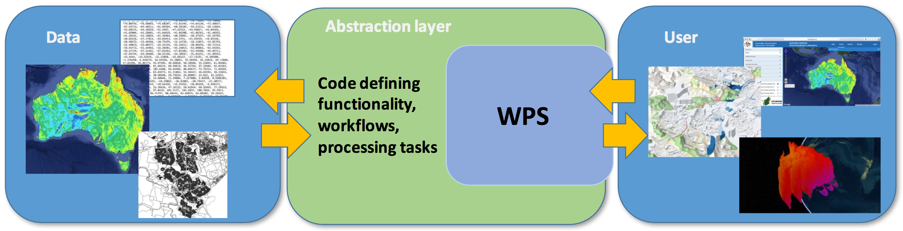
* Standard interface to data and compute resources
* Called by portals (CDS, Climate4Impact) and Jupyter Notebooks
---
### OGC Standard
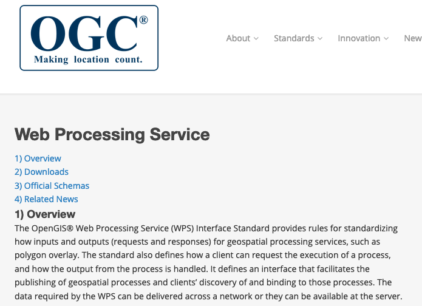
* Standard interface for Web Processing
* Define inputs and outputs
* *Function as a Service*
---
### PyWPS - Server
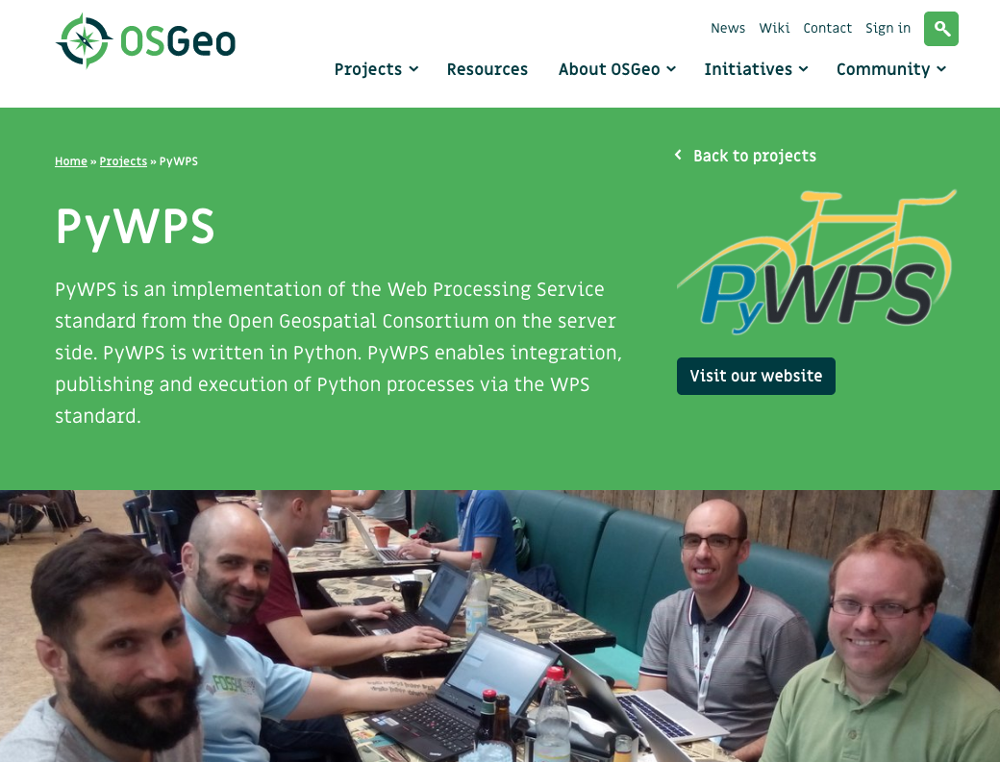
```note
To the ends of the Copernicus project, we use a PyWPS implementation for the web service. It’s an implementation of the WPS standard written in Python. It enables the use of python programs via the WPS.
```
* Python implementation of WPS
* Open Source
* Active community
---
### OWSLib - Client

* Python client-side implementation of WPS, WMS, WCS and more
---
### What is the Goal?
* Make climate data accessible to a wide audience, not only scientists
* Use a standards based compute service with a self-describing interface
* Example: data-reduction and common analysis as a service next to a large data data pool (CMIP5/CMIP6, CORDEX)
```note
The whole idea behind this specific part of the Copernicus project is to make climate data accessible to not only scientists and engineers, but also to a wide audience. This means that it’s possible to send self-explanatory values based on calculations on the raw data on top of the actual data, which is a big boon for accessibility.
```
---
## WPS for Climate Data Store
---
### CP4CDS
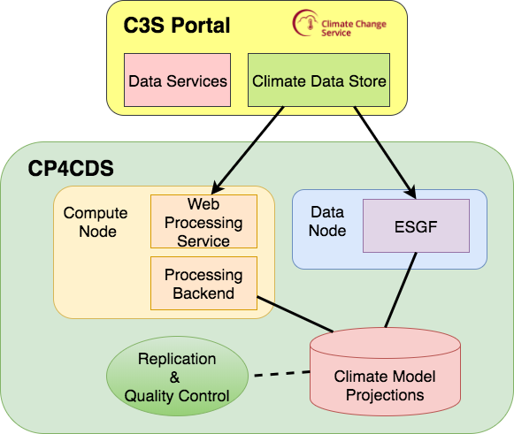
---
### CP4CDS Interfaces
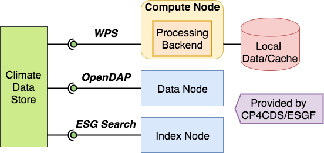
---
### Uptime 99%
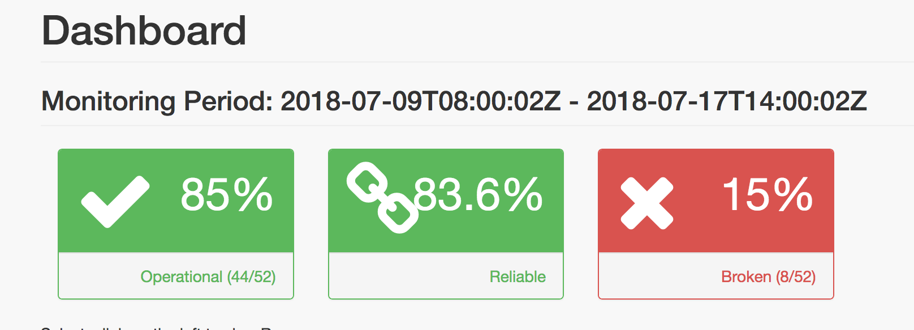
---
### Can't do it alone
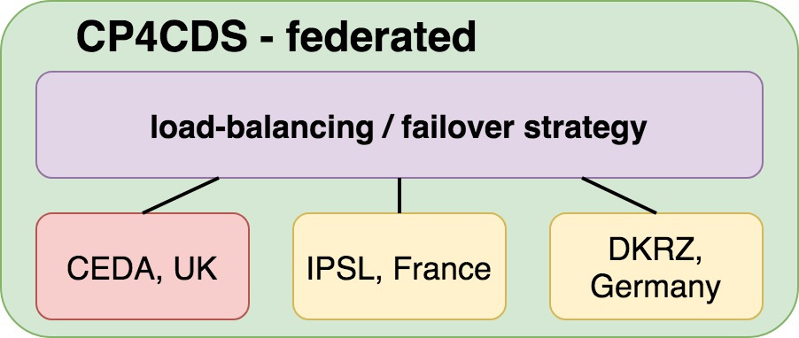
* Cloud based on Amazon Web Services
* Failover strategy for resilience
---
### Security
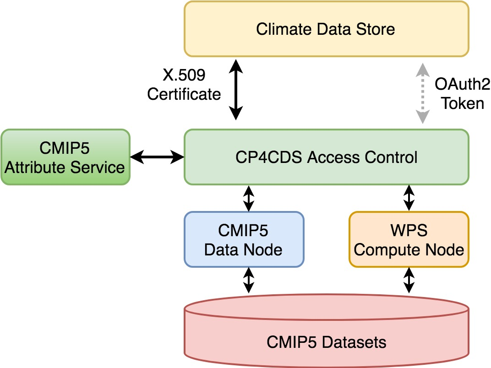
---
## Using WPS Template
```note
A template called "cookiecutter" was created. As the name suggests, it’s a cookie-cutter template that allows you to build your own WPS. This lets you create an implementation of PyWPS.
```
---
### Build your own WPS from a Template
* Cookiecutter: creates projects from project templates.
* Template for a PyWPS project.
* Generated WPS works out of the box.

https://cookiecutter-birdhouse.readthedocs.io/en/latest/
---
### Example
```
# Install cookiecutter
$ conda install -c conda-forge cookiecutter

# Run cookiecutter with PyWPS template
$ cookiecutter https://github.com/bird-house/cookiecutter-birdhouse.git

full_name [Full Name]: Daphne du Maurier
github_username [bird-house]: bird-house
project_name [Babybird]: Babybird
project_slug [babybird]: babybird
project_short_description [Short description]: A Web Processing Service for Climate Data Analysis.
version [0.1.0]: 0.1.0
http_port [5000]: 5000
```
Creates a PyWPS project named *babybird*.
```note
This will create a bird (PyWPS server) in your current directory. This bird contains configurable processes, along with some initial test processes.

If you want to add it to birdhouse, you can then do the following :

* Create a repo and put it there.
* Add the repo to your Travis-CI account.
* Add the repo to your ReadTheDocs account + turn on the ReadTheDocs service hook.
```
---
### Babybird
Add your WPS to GitHub
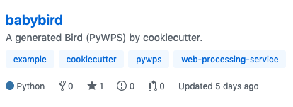

https://github.com/bird-house/babybird
---
## Working with the new WPS
---
### Install the WPS
Use conda env ... normal Python installation
```bash
# Get source from GitHub
$ git clone https://github.com/bird-house/babybird.git
$ cd babybird

# Create a conda environment
$ conda env create -f environment.yml
$ source activate babybird

# Run Python installation
$ pip install -e .[dev]
OR
$ make develop
```
https://babybird.readthedocs.io/en/latest/installation.html#install-from-github
---
### Tests included
```bash
$ make test # quick
$ make test-all # slow, online
$ make lint # codestyle checks
```
https://babybird.readthedocs.io/en/latest/dev_guide.html#running-tests---
---
### Start the Service
```bash
$ make start -c custom.cfg  # use defaults or use custom config
$ make status # running?
$ tail -f pywps.log # check logs
$ make stop # stop service
```
No additional installation steps necessary to run service in demo mode (using Werkzeug)
https://babybird.readthedocs.io/en/latest/installation.html#start-babybird-pywps-service
---
## The Client Side: Execute a Process
---
### Use the WPS with URL requests
```bash
http://localhost:5000/wps?service=WPS&version=1.0.0&
  request=GetCapabilities

http://localhost:5000/wps?service=WPS&version=1.0.0&
  request=DescribeProcess&
  identifier=hello

http://localhost:5000/wps?service=WPS&version=1.0.0&
  request=Execute&
  identifier=hello&
  DataInputs=name=Stranger
```
---
### Birdy command line tool
```bash
# Set URL to WPS
$ export WPS_SERVICE=http://localhost:5000/wps
# GetCapabilities
$ birdy -h
# DescribeProcess: hello
$ birdy hello -h
# Execute: hello
$ birdy hello --name Stranger
'Hello Stranger'
```
https://birdy.readthedocs.io/en/latest/api.html#module-birdy.cli
---
### Birdy in a Jupyter Notebook
```python
from birdy import WPSClient
client = WPSClient(url='http://localhost:5000/wps')
client.hello(name='Stranger')
```
https://birdy.readthedocs.io/en/latest/notebooks/examples/emu-example.html
---
## Modify your WPS
---
### Add a new Process
* Add a new PyWPS process class.
* Define the input and output parameters.
* Implement a *handler* method with the process code.
---
### Example
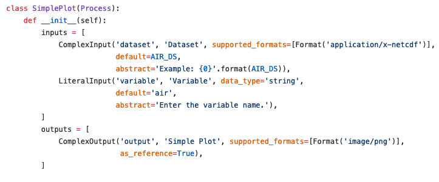
A Python class with inputs and outputs

https://birdhouse-workshop.readthedocs.io/en/latest/pywps/process.html#create-your-first-process
---
## WPS Deployment
---
### CP4CDS Toolbox (SDDS)
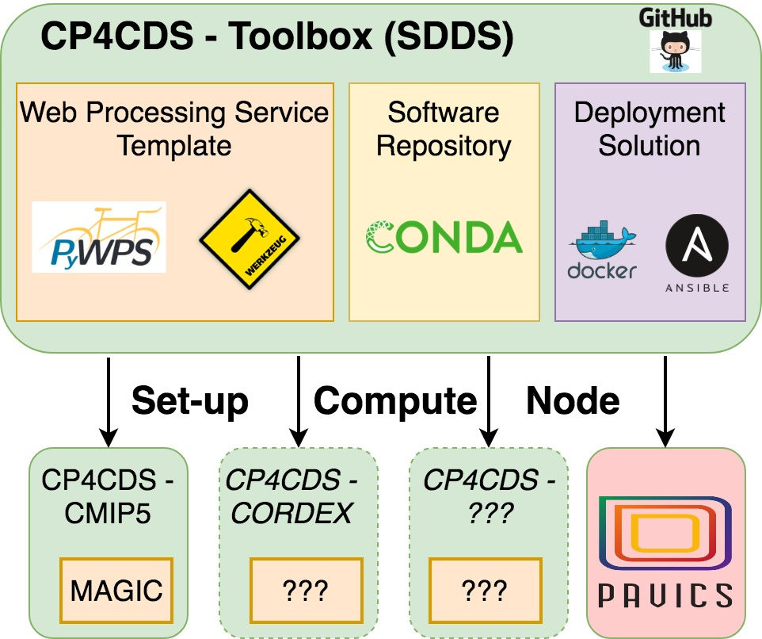
---
### Deploy as docker container
Dockerfile was generated by the cookiecutter
```bash
# build
$ docker build -t bird-house/babybird .
# run
$ docker run -p 5000:5000 bird-house/babybird
# test it
http://localhost:5000/wps?request=GetCapabilities&service=WPS
```
https://github.com/bird-house/babybird/blob/master/Dockerfile
---
### PyWPS full-stack
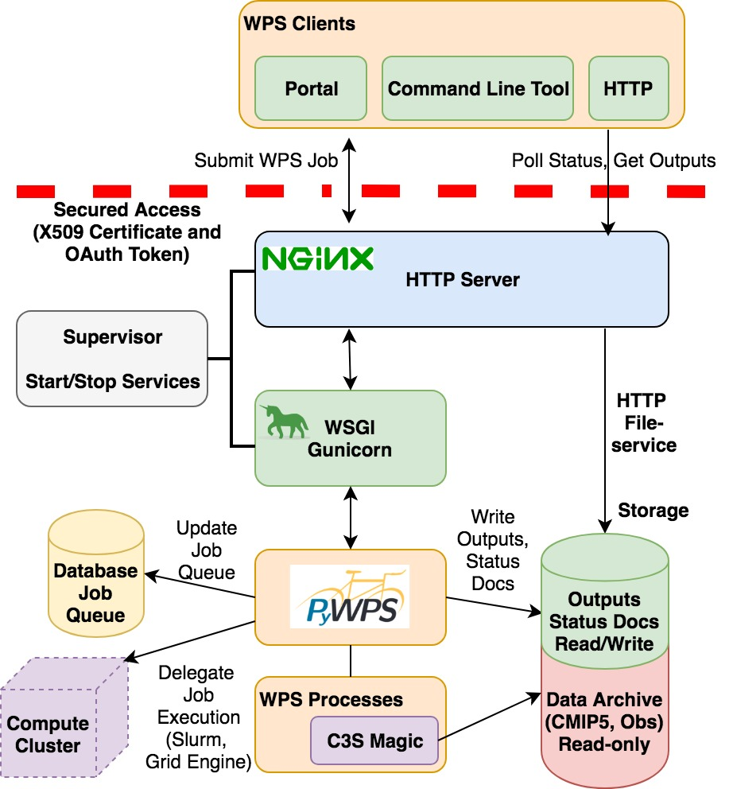
Need several other components to run in production: Nginx, Postgres, ...
---
### Deploy with Ansible
```bash
# Get Ansible playbook
$ git clone https://github.com/bird-house/ansible-wps-playbook.git
$ cd ansible-wps-playbook
# Edit config
$ vim custom.yml
# Run playbook
$ ansible-playbook -c local playbook.yml
```
Use Ansible playbook for full-stack deployment of PyWPS
https://ansible-wps-playbook.readthedocs.io/en/latest/deploy.html
---
### Test with Vagrant
Deploy with Ansible into a test virtual machine set-up by Vagrant
```bash
# Use Ansible playbook
$ cd ansible-wps-playbook
# use vagrant config
$ ln -s etc/sample-vagrant.yml custom.yml
# Vagrant starts a VM and deploys with Ansible
$ vagrant up
```
https://ansible-wps-playbook.readthedocs.io/en/latest/testing.html#test-ansible-with-vagrant
---
## Summary
* Use Cookiecutter template to create a new WPS project.
* New WPS is ready to use without additional installation steps.
* Dockerfile for container deployment is prepared.
* Ansible can be used for production deployment with Nginx and Postgres.
---
## Roadmap
* ???
---
## Links
* Website: http://bird-house.github.io/
* Development: https://github.com/bird-house
* CP4CDS: https://cp4cds.github.io/
* Presentation: https://github.com/cehbrecht/cp4cds-presentation-at-knmi-feb-2018/blob/master/cp4cds-for-magic.pdf
* Poster: https://github.com/cehbrecht/copernicus-poster-egu-2018/blob/master/copernicus-poster-egu-2018.pdf
---
## Thank You
* Carsten Ehbrecht, DKRZ
* Pierre Logerais, IPSL
