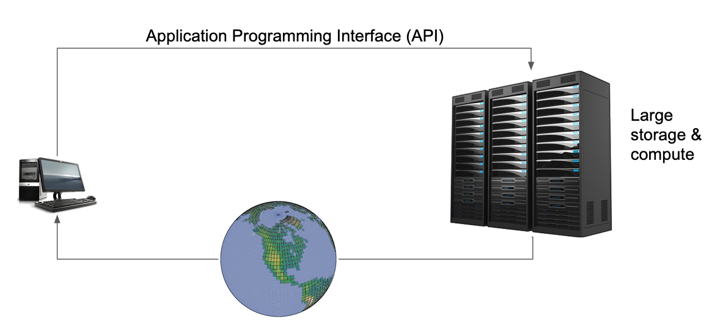
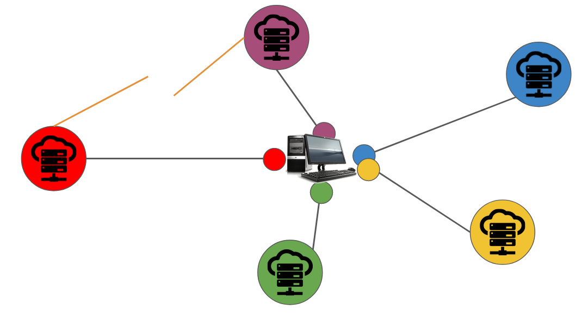
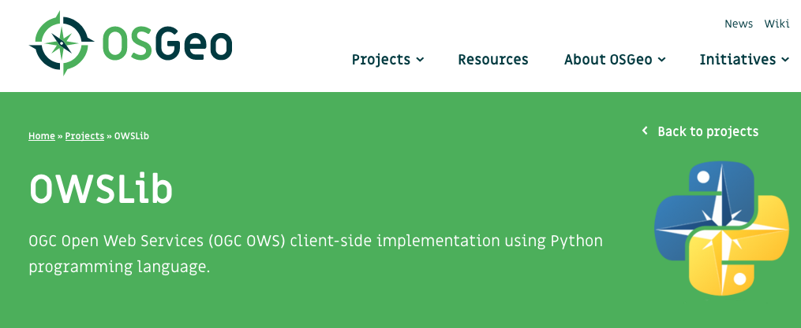
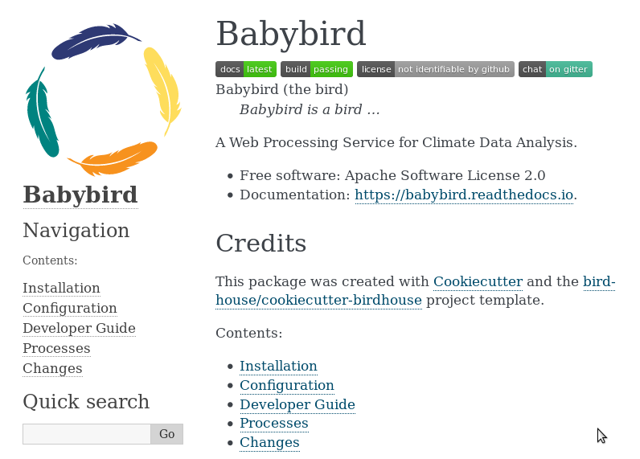

## Web Processing Service

Deploying a WPS for Copernicus Climate Data Store

Copernicus CORDEX4CDS Meeting
DMI, Copenhagen, 23-24 September 2019
---
## Table of Contents
* What is a Web Processing Service?
* Build your own WPS
* Using your WPS
* Deploy your WPS
---
## What is a WPS?
```note
WPS (Web Processing Service) is a standard developed by the Open Geospatial Consortium (OGC). It provides standard rules to invoke geospatial processing services as a web service. This means that it makes it both easy and flexible to share any geographical data, including climate data.

It can also describe any calculation on all of its inputs and outputs.

As an example, it’s possible to use a WPS to send data like average temperature, peak temperature, or any calculated data, for every model.
```
---
### Scientific number-crunching is moving into the cloud

```note
Slide taken from talk by David Huard, Ouranos:
https://docs.google.com/presentation/d/17OUMAQd6596RX9eYb2aRKrtzdlZhnuBx38FojBpHy8M/edit#slide=id.p

A large scale trend in the scientific world is the move toward online virtual labs. Also called research platforms, these are web sites where data and tools are made available to scientists. There are a number of different reasons these labs are set up: for some it's facilitating access and analyis to large large datasets, for others it's lower the barrier to massive parallel computations or collaborate with peers.

Typically, online services are offered programmatically by an Application Programming Interface (API). By a simple call to this API, a user can trigger processes requiring heavy computations on extremely large databases. The idea behind the API model is for scientist to do the light analysis on their laptops, a delegate the compute-heavy jobs to remote high performance machines.

Although API calls can be simple enough to be written by hand, they are usually used as a machine to machine communication protocol. In practice, that means there's usually some kind of user-friendly interface sitting between the user and the server API: it could be a web page or a client software library.

Web based virtual labs are thus composed of algorithms sitting on the server, and client libraries installed by users.
```
---
### But we could get stuck with multiple APIs and clients

```note
The concern I have is that as online scientific services grow in popularity, APIs and client libraries will multiply, both on the server and the client side. Scientists who want to host their services online will have to select a platform, which will restrict access to users who know how to use the client for that particular API. Users on the other will most likely have to cobble together calls to different servers using different clients to get original research done.
```
---
### WPS is an OGC standard for remote processing

* Define inputs and outputs of your *processes* ("functions")
* Like *"Function as a Service"*
```note
Standard can help with the multiplication of solutions. WPS is a standard for web processing services. It’s in the same family as WMS, which powers a lot of online map visualizations.
```
---
### WPS operations
* **GetCapabilities** – List available processes
* **DescribeProcess** – Inputs and outputs of a process
* **Execute** – Launch a process
---
### Usually it looks like this
```bash
http://localhost:5000/wps?
  service=WPS&
  version=1.0.0&
  request=Execute&
  identifier=hello&
  DataInputs=name=Stranger
```
---
### Mostly used by user-friendly clients

Like portals, Jupyter notebooks, ...
---
### PyWPS - Server

* Python implementation of WPS
* Like a bicycle easy to use
* Open Source and active community
```note
To the ends of the Copernicus project, we use a PyWPS implementation for the web service. It’s an implementation of the WPS standard written in Python. It enables the use of python programs via the WPS.

There are other implementations available like:
* 52North WPS (Java): https://52north.org/software/software-projects/wps/
* Zoo (C++): http://zoo-project.org/
```
---
### What is the Goal?
* Make climate data accessible to a wide audience
* Use a standards based compute service
* Example: data-reduction as a service next to a large data data pool (CORDEX)
```note
The whole idea behind this specific part of the Copernicus project is to make climate data accessible to not only scientists and engineers, but also to a wide audience. This means that it’s possible to send self-explanatory values based on calculations on the raw data on top of the actual data, which is a big boon for accessibility.
* Make climate data accessible to a wide audience, not only scientists
* Use a standards based compute service with a self-describing interface
* Example: data-reduction and common analysis as a service next to a large data data pool (CMIP5/CMIP6, CORDEX)
```
---
### WPS for Climate Data Store

* Climate projections for Climate Data Store
* ESGF data nodes for CMIP5, CORDEX
* WPS for compute nodes
---
## Build your own WPS
```note
A template called "cookiecutter" was created. As the name suggests, it’s a cookie-cutter template that allows you to build your own WPS. This lets you create an implementation of PyWPS.
```
---
### Use a Cookiecutter Template
* [Cookiecutter](https://cookiecutter.readthedocs.io/en/latest/): Python tool to create projects from templates
* We have a cookiecutter template for a PyWPS project
* Generated PyWPS project works out of the box

https://cookiecutter-birdhouse.readthedocs.io/en/latest/
---
### Example
```bash
# Install cookiecutter
$ conda install -c conda-forge cookiecutter

# Run cookiecutter with PyWPS template
$ cookiecutter https://github.com/bird-house/cookiecutter-birdhouse.git

full_name [Full Name]: Daphne du Maurier
github_username [bird-house]: bird-house
project_name [Babybird]: Babybird
project_slug [babybird]: babybird
project_short_description [Short description]: A Web Processing Service for Climate Data Analysis.
version [0.1.0]: 0.1.0
http_port [5000]: 5000
```
Creates a PyWPS project named *babybird*.
```note
This will create a bird (PyWPS server) in your current directory. This bird contains configurable processes, along with some initial test processes.

If you want to add it to birdhouse, you can then do the following :

* Create a repo and put it there.
* Add the repo to your Travis-CI account.
* Add the repo to your ReadTheDocs account + turn on the ReadTheDocs service hook.
```
---
### Babybird
Add your new WPS service to GitHub

https://github.com/bird-house/babybird
---
## Working with the new WPS
---
### Install your WPS
```bash
# Get source from GitHub
$ git clone https://github.com/bird-house/babybird.git
$ cd babybird

# Create a conda environment
$ conda env create -f environment.yml
$ source activate babybird

# Run Python installation
$ pip install -e .[dev]
OR
$ make develop
```
* Use [Conda](https://conda.io/en/latest/) to manage dependencies
* Normal Python installation
---
### Start the Service
```bash
# start service with custom config
$ make start -c custom.cfg

# run GetCapabilities request
$ curl -o caps.xml \
  "http://localhost:5000/wps?service=WPS&request=GetCapabilities"

# check logs
$ tail -f pywps.log
```
No additional installation steps necessary to run service (using [Werkzeug](https://palletsprojects.com/p/werkzeug/) library)
```note
This installation is meant for developing and testing. It is not recommend to be used in production.
```
---
### Try with Birdy as WPS client
```python
from birdy import WPSClient
babybird = WPSClient(url='http://localhost:5000/wps')
output = babybird.hello(name='Stranger')
print(output.get())
'Hello Stranger'
```
* Can be used in Jupyter Notebooks
* WPS functions feel like normal Python functions

https://birdy.readthedocs.io
```note
We wanted WPS functions to feel as normal python functions.
Processes are called just like ordinary functions.
Has a truly pythonic interface

https://birdy.readthedocs.io/en/latest/notebooks/examples/emu-example.html
```
---
## Deploy your WPS
---
### PyWPS full-stack

Need several other components to run in production: Nginx, Postgres, ...
---
### Deploy with Ansible
```bash
# Get Ansible playbook
$ git clone \
  https://github.com/bird-house/ansible-wps-playbook.git
$ cd ansible-wps-playbook

# Edit config: point it to your WPS on GitHub
$ vim custom.yml

# Run playbook
$ ansible-playbook -c local playbook.yml
```
* Use [Ansible](https://www.ansible.com/) playbook for full-stack deployment of PyWPS
* Ansible: language for IT automation
```note
https://ansible-wps-playbook.readthedocs.io/en/latest/deploy.html
```
---
### Test with Vagrant
Deploy with Ansible into a test virtual machine set-up by [Vagrant](https://www.vagrantup.com/)
```bash
# Use Ansible playbook
$ cd ansible-wps-playbook

# use vagrant config
$ cp etc/sample-vagrant.yml custom.yml

# Vagrant starts a VM and deploys with Ansible
$ vagrant up
```
```note
https://ansible-wps-playbook.readthedocs.io/en/latest/testing.html#test-ansible-with-vagrant
```
---
## Summary
* WPS is standard interface for remote processing
* Use Cookiecutter template to create a new WPS project
* New WPS is ready to use without extra installation steps
* Ansible can be used for production deployment
---
## Links
* Website: http://bird-house.github.io/
* Development: https://github.com/bird-house
* CP4CDS: https://cp4cds.github.io/
* Presentation: https://github.com/cehbrecht/wps-talk-copernicus-cordex-dmi-meeting-2019
* Poster: https://github.com/cehbrecht/copernicus-poster-egu-2018/blob/master/copernicus-poster-egu-2018.pdf
---
## Thank You
* Pierre Logerais, IPSL
* Katharina Berger, DKRZ
* Carsten Ehbrecht, DKRZ
---
## Extra slides
---
### OWSLib - Client

* Python client-side implementation of WPS, WMS, WCS and more
---
### CP4CDS Interfaces

---
### Uptime 99%

---
### Can't do it alone

* Cloud based on Amazon Web Services
* Failover strategy for resilience
---
### Security

---
### Documentation
Add your WPS documentation to ReadTheDocs

https://babybird.readthedocs.io/en/latest/index.html
---
### Tests included
```bash
$ make test # quick
$ make test-all # slow, online
$ make lint # codestyle checks
```
### Use the WPS with URL requests
```bash
http://localhost:5000/wps?service=WPS&
  request=GetCapabilities

http://localhost:5000/wps?service=WPS&version=1.0.0&
  request=DescribeProcess&
  identifier=hello

http://localhost:5000/wps?service=WPS&version=1.0.0&
  request=Execute&
  identifier=hello&
  DataInputs=name=Stranger
```
---
---
### Birdy command line tool
```bash
# Set URL to WPS
$ export WPS_SERVICE=http://localhost:5000/wps
# GetCapabilities
$ birdy -h
# DescribeProcess: hello
$ birdy hello -h
# Execute: hello
$ birdy hello --name Stranger
'Hello Stranger'
```
Using the Python OWSLib library for WPS
```note
The birdhouse team, a collaborative working to deliver free and open climate science tools, built a shell client.

https://birdy.readthedocs.io/en/latest/api.html#module-birdy.cli
```
---
### Modify your WPS

* Create a Python class
* Define the input and output parameters.
* Implement a *handler* method with the process code.
```note
https://birdhouse-workshop.readthedocs.io/en/latest/pywps/process.html#create-your-first-process
```
---
### Sofware Deployment Solution

---
### Deploy as docker container
Dockerfile was generated by the cookiecutter
```bash
# build
$ docker build -t bird-house/babybird .
# run
$ docker run -p 5000:5000 bird-house/babybird
# test it
http://localhost:5000/wps?request=GetCapabilities&service=WPS
```
```note
https://github.com/bird-house/babybird/blob/master/Dockerfile
```
---
